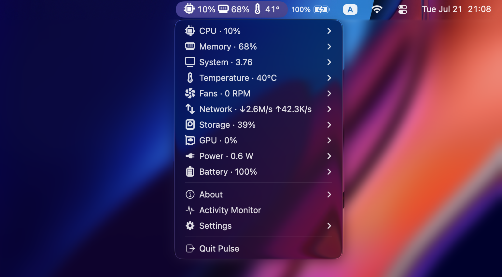

# &nbsp; Pulse

**See what your Mac is doing — right from the menu bar.**

Pulse puts your Mac's vital signs at the top of the screen: how busy the
processor is, how much memory is in use, how hot it's running, fan speed,
network and disk activity, battery health, and more. It's tiny, native, and
free — no window to manage, no Dock icon, no account.

It's a macOS take on the popular GNOME extension
[Vitals](https://github.com/corecoding/Vitals) — the same idea, rebuilt from
scratch for the Mac.

<p align="left">
  <a href="https://github.com/emgeorrk/pulse/actions/workflows/ci.yml"></a>
  <a href="https://github.com/emgeorrk/pulse/releases/latest"></a>
  <a href="LICENSE"></a>
  
</p>

<p align="center">
  
</p>

## How it works

- **Pin what matters.** Pick any metric and it shows live, right in the menu
  bar next to the clock.
- **Click for the full picture.** The dropdown lists every group — CPU, memory,
  temperature, and so on — each with a live summary.
- **Stays out of the way.** No Dock icon, no floating window. Quit from the
  dropdown whenever you like.

## What it shows

- **CPU** — how hard the processor is working, overall and per core, with a
  little live graph in the menu bar
- **Memory** — how much RAM is in use, plus swap
- **Temperature** — how hot the chip and its parts are running
- **Fans** — fan speed (hidden on fanless Macs like the MacBook Air)
- **Network** — upload and download speeds, plus totals
- **Disk** — free space and read/write speeds
- **GPU** — how busy the graphics are
- **Power** — how many watts the CPU, GPU, and Neural Engine are drawing
- **Battery** — charge, health, cycles, temperature, and time remaining

If your Mac doesn't have a particular sensor, Pulse simply hides that section —
it never gets in the way.

## Install

### Homebrew (recommended)

```sh
brew install emgeorrk/tap/pulse
ln -sfn "$(brew --prefix)/opt/pulse/Pulse.app" /Applications/Pulse.app
open /Applications/Pulse.app
```

Homebrew builds Pulse on your own machine, so macOS opens it without any
security warnings. The second line adds it to your Applications folder, and
`brew upgrade pulse` keeps it up to date.

### Download the app (Apple Silicon Macs)

1. Download `Pulse-<version>-arm64.zip` from the
   [Releases](https://github.com/emgeorrk/pulse/releases/latest) page and unzip
   it.
2. Move `Pulse.app` into your **Applications** folder.
3. Open **Terminal**, paste the two lines below, and press Return:

   ```sh
   xattr -dr com.apple.quarantine /Applications/Pulse.app
   open /Applications/Pulse.app
   ```

The downloaded app isn't signed by Apple, so macOS blocks it at first. The first
line tells macOS the app is safe; the second one launches it.

> This ready-made download is for **Apple Silicon** Macs (M1 and newer). On an
> older Intel Mac, use Homebrew or build it yourself.

### Launch at login

Open Pulse's **Settings** and turn on **Launch at login** — it'll start
automatically every time you sign in.

## Settings

Everything is in the dropdown menu:

- **Update speed** — refresh every 1, 2, 3, or 5 seconds
- **Temperature** — °C or °F
- **Data units** — GB or GiB
- **Menu bar graph** — show or hide the little CPU sparkline
- **Launch at login**

## Questions

**Does it need my password or admin rights?** No. Pulse reads everything from
regular user space — it never asks for a password.

**Will it slow my Mac down?** No. It wakes up a few times a second, reads the
sensors, and goes back to sleep. The footprint is tiny.

**Intel Macs?** Pulse runs, but the Intel sensor readings (temperature and fans)
haven't been tested on real Intel hardware yet, so some of those numbers may be
missing or off. Apple Silicon is fully supported.

## For developers

Pulse is written in Go with CGO, reading Apple's IOKit, SMC, HID, and IOReport
interfaces directly — no `sudo`, no `powermetrics`.

Build from source (needs macOS 12+, Xcode command line tools, and Go 1.26):

```sh
make run    # build the app, sign it, and launch it
make once   # print one metrics frame to the terminal (no UI)
make test   # run the tests
```

Architecture, conventions, and the Apple Silicon vs. Intel sensor paths are
documented in [CLAUDE.md](CLAUDE.md).

Verified on Apple Silicon. Everything except the Intel-only paths has been
tested there. If you confirm a feature on other hardware, a note in a PR is
welcome.

Before opening a pull request:

```sh
make test   # unit tests
make lint   # golangci-lint (strict)
make vet    # go vet
```

## License

[MIT](LICENSE) © 2026 Egor Merkushev.
